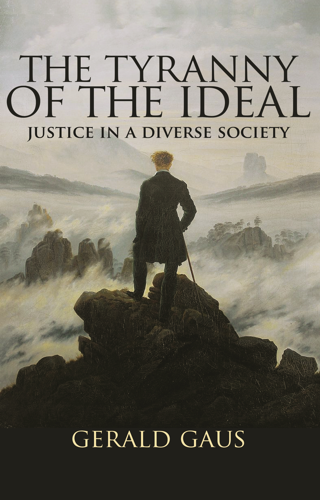

# <em> The Tyranny of the Ideal</em> Study Guide

# Introduction
These are my reading notes for [_The Tyranny of the Ideal: Justice in a Diverse Society_][book] by Gerald Gaus.

This text was selected by a Discord reading group that I was invited to by user Antidepressants ([twitch][anti-twitch], [youtube][anti-youtube]), a recently-graduated Masters student in [PPE](https://en.wikipedia.org/wiki/Philosophy,_politics_and_economics).

# Table of Contents

  [<em>Preface</em>][C-0]
  
  [CHAPTER I: The Allure of the Ideal: Orienting the Quest for Justice][C-1]
  
  [CHAPTER II: The Elusive Ideal: Searching under a Single Perspective][C-2]
  
  [CHAPTER III: The Fractured Ideal: Searching with Diverse Perspectives][C-3]
  
  [CHAPTER IV: The Nonideal: The Open Society][C-4]
  
  [CHAPTER V: Advancing from the Citadel][C-5]

[C-0]: ./Preface.md
[C-1]: ./Chapter-1.md
[C-2]: ./Chapter-2.md
[C-3]: ./Chapter-3.md
[C-4]: ./Chapter-4.md
[C-5]: ./Chapter-5.md

[book]: https://www.amazon.com/Tyranny-Ideal-Justice-Diverse-Society/dp/0691158800
[anti-twitch]: https://www.twitch.tv/antidepress4nts
[anti-youtube]: https://www.youtube.com/channel/UC2irnSjbuQnn0HxgbHy6Yzw
